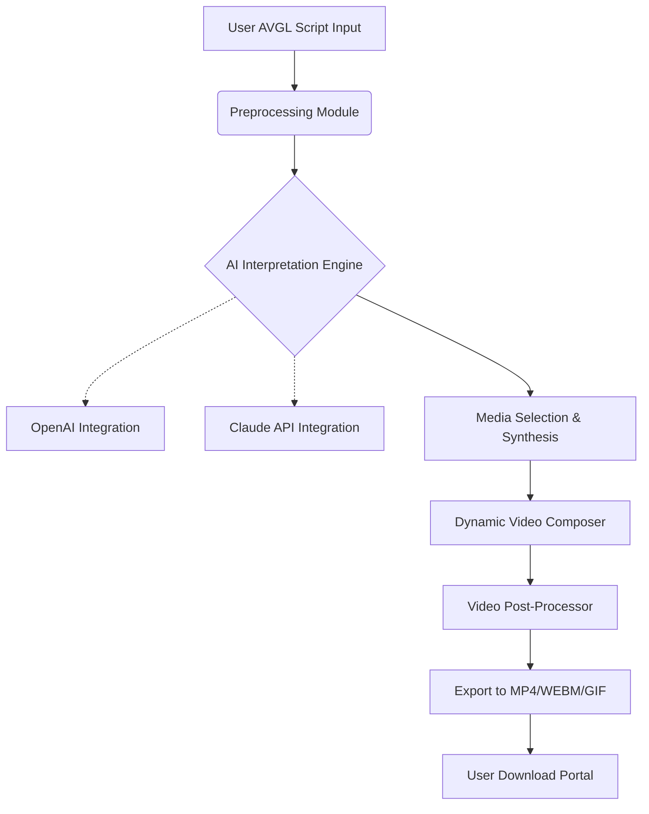

# 🎬 Videostripe: Generative AI B-Roll Engine for Creators  
### aivideogen-inspired | Automated B-Roll Video Generation Powered by AVGL Scripting

---

**Videostripe** redefines cinematic storytelling with an AI-driven engine that autonomously builds engaging B-Roll videos from AVGL (Audio-Visual Generation Language) scripts. Designed to empower filmmakers, marketers, educators, and content creators, Videostripe connects words, sounds, and visuals—then breathes life into footage with advanced multimodal AI.  
Forget rigid timelines. Harness *algorithmic serendipity* for eye-catching cutaways, overlays, and transitions—every time.

*Automated. Artful. Always evolving.*

---

## ⚡ Table of Contents

- [About Videostripe](#about-videostripe)
- [Mermaid Architecture Diagram](#mermaid-architecture-diagram)
- [Key Features](#key-features)
- [Why Videostripe?](#why-videostripe)
- [SEO-Infused Use Cases](#seo-infused-use-cases)
- [AVGL Example Profile Configuration](#avgl-example-profile-configuration)
- [🔥 Example Console Invocation](#-example-console-invocation)
- [🌐 OS Compatibility Matrix](#-os-compatibility-matrix)
- [Integration: OpenAI & Claude APIs](#integration-openai--claude-apis)
- [Getting Started](#getting-started)
- [License](#license)
- [Disclaimer](#disclaimer)
- [Download](#download)

---

## 🤖 About Videostripe

**Videostripe** is an avant-garde AI-powered B-Roll video generator inspired by AIVideogen. By leveraging AVGL scripting, Videostripe automates the tedious process of sourcing, editing, and synchronizing B-Roll with voiceovers and music beds. It is the creative’s co-pilot—filling in silent spaces with relevant, dynamic, copyright-safe clips and transitions.

Primed for creators who juggle deadlines and demand seamless video storytelling—without hours on stock footage sites or complex editing software.

---

## 🎨 Mermaid Architecture Diagram

---

## 🚀 Key Features

- **AVGL Scripting Support:** Write, import, and modify AVGL scripts to blueprint audio-visual relationships.
- **Automated B-Roll Injection:** AI analyzes script narrative, tone, and context to insert perfect B-Roll material.
- **Responsive UI:** Across devices—an experience as fluid as your narrative, whether desktop or touch-based.
- **Multilingual Support:** Generate videos and interface in 17+ languages, serving global audiences.
- **API Integrations:** Seamless synergy with OpenAI and Claude—fueling script interpretation, dialogue generation, and proactive suggestion.
- **Never-Sleeps Support:** Round-the-clock customer care, resolving creative & technical questions at any moment.
- **Format Flexibility:** Export in MP4, WebM, or GIF at customizable resolutions.
- **Metadata Embedding:** SEO-friendly video titles, tags, and descriptions auto-generated from your scripts.
- **Creative Assets Library:** Access an always-growing, copyright-secure media library with smart recommendations.
- **AI-powered Scene Transitions:** Dynamic fades, wipes, and animated overlays—no editing needed.
- **Privacy-by-Design:** No content stored without explicit project saves. GDPR & CCPA ops baked in.

---

## 🎯 Why Videostripe?

Instead of hours in the editing suite, let **Videostripe** listen to your story, understand your message, and paint it with AI-selected cutaways and overlay moments. Speed meets inspiration as you:

- Make videos that grab attention at a glance (SEO gold for social and YouTube).
- Preserve creative focus—leave the routine to artificial intelligence.
- Bridge language barriers; tell universal stories that resonate around the globe.
- Scale unique B-Roll production across marketing campaigns, online courses, and influencer reels.

---

## 📈 SEO-Infused Use Cases

- **YouTube Channel Growth:** Automated cutaway compilation, dynamic thumbnails, and keyword-centric tags boost discoverability.
- **Corporate Explainers:** Multilingual training videos localized for different markets.
- **Online Education:** Create engaging lesson materials with relevant B-roll, synchronized captions, and atmospheric music.
- **Content Repurposing:** Turn podcasts, blogs, or transcripts into visual video montages with one command.
- **Social Media Marketing:** Generate short-form video ads with trending overlays, hashtags, and dynamic cutaways automatically.

---

## 📝 AVGL Example Profile Configuration

Use an AVGL configuration file to define your video’s personality and structure.

    profile:
      language: "Spanish"
      main_theme: "Technología del Futuro"
      voiceover: "spanish_female_neutral"
      background_music: "electro_ambient"
      b_roll_intensity: 0.74
      transitions: ["fade", "slide"]
      aspect_ratio: "16:9"
      captions: true
      seo_keywords: ["IA", "video automatizado", "tecnología creativa"]

---

## 🔥 Example Console Invocation

Ready to transform a script into a vibrant B-roll experience? The following command will guide you:

    $ videostripe generate \
        --script myPresentation.avgl \
        --output myBrollCompilation.mp4 \
        --language es \
        --seo-metadata \
        --auto-caption \
        --openai-api-key yourkey \
        --claude-api-key anotherkey

>Tip: Add `--assets customMedia/` to pull in your own branded clips.

---

## 🌍 OS Compatibility Matrix

| Platform       | Supported | Notes                                      |
| -------------- | :-------: | ------------------------------------------ |
| 🪟 Windows 10+ |    ✅    | 64-bit, WSL support for enhanced features  |
| 🍏 macOS 12+   |    ✅    | Universal (Intel & Apple Silicon chips)    |
| 🐧 Linux       |    ✅    | Tested on Ubuntu, Fedora, Arch, CentOS     |
| 📱 iOS         |    ✅    | iPad/iPhone browser-based UI (PWA-ready)   |
| 🤖 Android     |    ✅    | Chrome/Firefox mobile UI                   |

*Run anywhere; your imagination is the only limit!*

---

## 🧠 Integration: OpenAI & Claude APIs

Videostripe automates script interpretation, narration creation, and scene suggestion via:

- **OpenAI GPT Integration:** Understands instructions, proposes B-roll moments, autowrites SEO metadata.
- **Claude API Support:** Senses narrative context and modulates emotional tone. Generates captions that feel alive.

📖 To enable, just supply your API keys—Videostripe handles the rest, securely.

---

## 🚦 Getting Started

1. **Download and Install:**
   - [Download](#download) the latest release for your system.  
     

2. **Configure Your Profile:**
   - Edit your AVGL configuration (`.avgl` or `.yaml`).

3. **Run with Your Own Scripts:**
   - Invoke via command line, or use the intuitive GUI.

4. **Explore and Evolve:**
   - Build, preview, and regenerate as your script matures. Experiment with languages and custom B-roll assets.

---

## 📜 License

Videostripe is governed by the permissive MIT License—enabling flexible use for creators, enterprises, and educators. See full license text [here](https://opensource.org/licenses/MIT).

---

## ⚠️ Disclaimer

Videostripe (c) 2026 is designed to assist and augment the creative process, not to replace original authorship. Outputs are algorithmically generated based on your script and configuration. Ensure your final videos meet your platform’s content, copyright, and ethical guidelines.  
By using Videostripe, you agree to comply with OpenAI and Claude API policies. No private data is retained unless explicitly saved within user projects.

---

## 📥 Download

Download the latest release here  

---
*Videostripe: Powering 21st-century storytellers, everywhere. 2026*